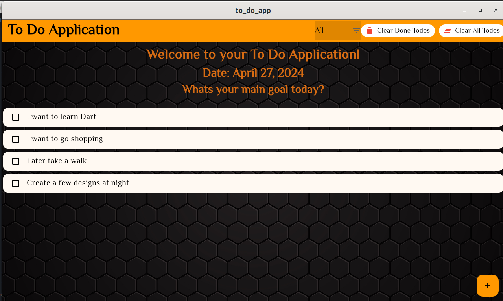
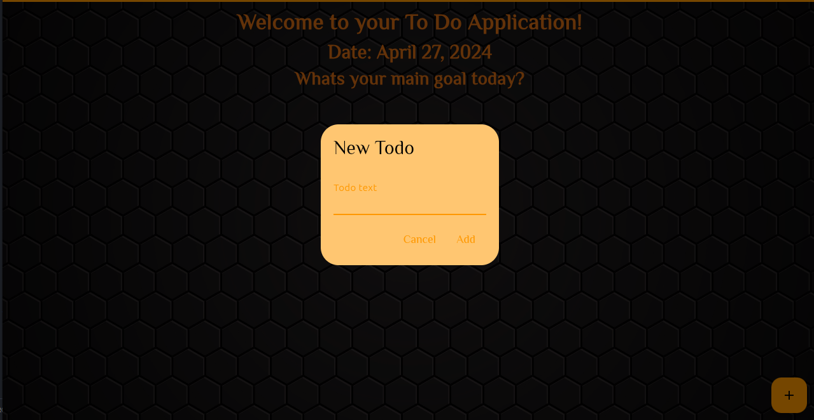
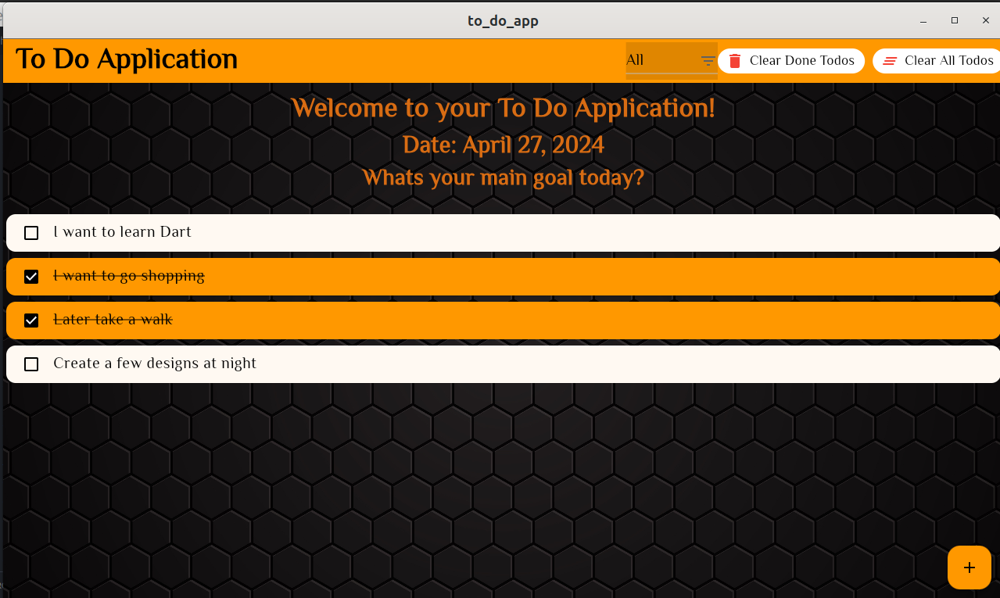

# to_do_app

#### By Reuben Kipkemboi

## Table of Content

- [Description](#description)
- [Installation Requirement](#installation-requirements)
- [Technology Used](#technologies-used)
- [License](#license)
- [Authors Info](#authors-info)

## Description

The To-Do app is a simple mobile application developed using Flutter, a framework for building cross-platform apps. This app allows users to create, manage, and organize their tasks effectively.

[Go Back to the top](#to_do_app)

## User Stories

User Can :-

- Add new tasks: Users can easily add new tasks by entering the task description and tapping the "Add" button.
- Mark tasks as completed: Users can mark tasks as completed by tapping the checkbox next to each task.
- Filter tasks: Users can filter tasks based on their completion status - All tasks, Completed tasks, or Pending tasks.
- Clear tasks: Users can clear all tasks at once or clear only the completed tasks.
- Date display: The app displays the current date on the home screen to help users track their tasks.
- Clear all the tasks by clicking on Clear All Todos Button.
- Clear completed Tasks by clicking on Clear Done Todos Button.

[Go Back to the top](#to_do_app)

Application details



Add Tasks



Check completed tasks



View Pending,completed and All Tasks


## Installation Requirements

### Prerequisites

- Flutter
- Dart

The To-Do app uses the following dependencies:

- `intl` package: For date formatting.
- `google_fonts` package: For using custom fonts.

## Instructions

### Install Flutter

- Install Flutter: If you haven't already, install Flutter by following the instructions in the [Flutter documentation](https://flutter.dev/docs/get-started/install).

##### Clone Repository:

```bash
https://github.com/Reuben-Kipkemboi/flutter-hack

```

#### Navigate to Directory

Navigate to the project directory: Open a terminal window and navigate to the directory where you cloned the repository.

#### Run the Application

Run the app: Use the `flutter run` command to run the app on an emulator or connected device.

[Go Back to the top](#to_do_app)

## Technologies Used


## License

[](https://opensource.org/licenses/MIT)

[MIT License](LICENSE)

## Author's Info

:email: [Reuben Kipkemboi](https://gmail.com)

<p align = "center">
    &copy; 2024 @Reuben Kipkemboi.
</p>
